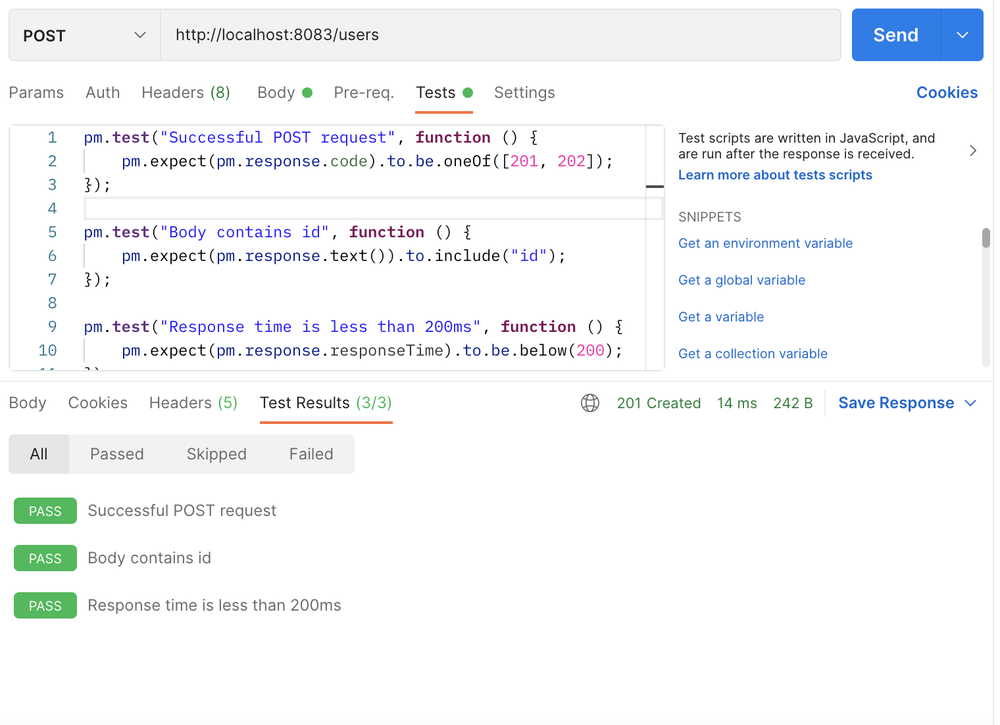
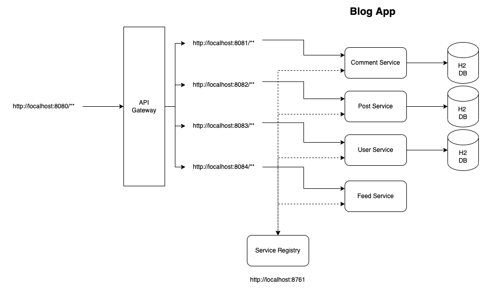
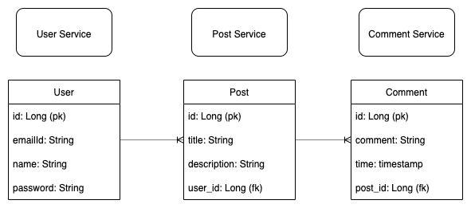

# Blog Application (Microservices)

### Unit Test Cases

* Comment Service

### Integration Test Cases

* Post Service

### Postman Test Cases

* User Service
* Post Service
* Comment Service

### Mutation Test Cases

* Comment Service
> mvn test-compile org.pitest:pitest-maven:mutationCoverage

> target -> pit-reports -> timestamp -> index.html

### End Points

#### API Gateway
> http://localhost:8080/

Circuit Breaker Implemented

#### User Service
> http://localhost:8083/users

#### Post Service
> http://localhost:8082/posts

#### Comment Service
> http://localhost:8081/comments

#### Recommendation Service
> http://localhost:8084/feed

### Swagger UI

> http://localhost:port_number/swagger-ui.html

### Swagger API Docs

> http://localhost:port_number/v2/api-docs

### Actuators

> http://localhost:port_number/actuator/info, http://localhost:port_number/actuator/health etc..

## Architecture Diagram

## ER Diagram

### References
* https://springframework.guru/testing-spring-boot-restful-services/
* https://reflectoring.io/spring-boot-test/
* https://docs.spring.io/spring-framework/docs/current/reference/html/testing.html
* https://learning.postman.com/docs/writing-scripts/test-scripts/
* https://pitest.org/

### Other Repositories

* https://github.com/Deloitte/DynamoDB-REST-APIs-Example.git
* https://github.com/Deloitte/Blog-App-Monolith.git
* https://github.com/Deloitte/Blog-App-Microservices.git
* https://github.com/Deloitte/Blog-App-Microservices-API-Gateway.git
* https://github.com/Deloitte/Blog-App-Microservices-Unit-Integration-Testing.git
